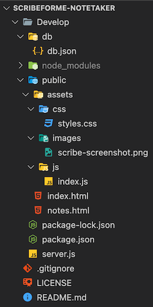
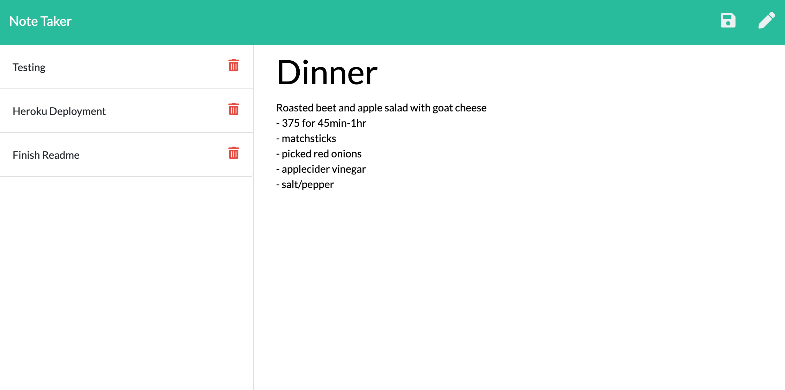

# Scribe For Me 
[](https://opensource.org/licenses/MIT)
****

## Project overview

This application is a note taker, allowing the user to record, save, and access notes/tasks in one place. Simple and easy to use, get ready to have a personal scribe for you!

### Project Status:

This project is completed and functional.

#### Issues to debug:
* `TypeError [ERR_INVALID_ARG_TYPE]` : fixed function for API app.get route : RESOLVED

* New notes were saved but not posted on the page, Chrome Devtools helped to show that `server.js` was not linked : `app.use(express.static('public'));` : RESOLVED

* Saved notes not deleting, cleaned code up using variable to declare pathfile : 

    `  let dbPath = path.join(__dirname, './db/db.json')`

    ...to be used in the following...

    ```
        fs.writeFile(dbPath, JSON.stringify(db), (err) => {
        err ? console.error(`FAILED TO WRITE >>>>`, err) : console.log(`New note saved!`)
        });
    ```
    : RESOLVED

****

## MVP

### Project-build Aspects:

The following components are used to build the code for this project:

1. front-end source code provided by the program (see Credit section)
2. Node enviornment and the following npm packages:
    * Express
    * fs
    * uuid
3. Heroku for application deployment

### Functionality:

The following lists all functions within this project:

* user can input new notes and save
* user can see displayed saved notes and access
* user can delete saved notes

### Process:

* `npm init` ran to create `package.json` file
* required packages installed as dependencies
* referred to class activities as resources and psuedo-coded logic for creating GET and POST routes
* Insomnia used to check routes

****

## Installation

1. Clone this repository onto local workspace
2. Open Terminal (MacOS) or Git Bash (Windows) and change location to where you want the cloned directory
3. Type `git clone` and paste copied respository
4. Directory should include the following, excluding node-modules:


## Usage

If accessing application from source code -
RUN WITH CLI:
```
npm start
```

## Application Screenshot



****

## Deployment


****

## License

This project is licensed under MIT.

## Credit

* Full-stack Bootcamp Program @ [Washington University, Saint Louis](https://bootcamp.tlcenter.wustl.edu/) through [© 2021 Trilogy Education Services, LLC, a 2U, Inc. brand](https://www.trilogyed.com/)


